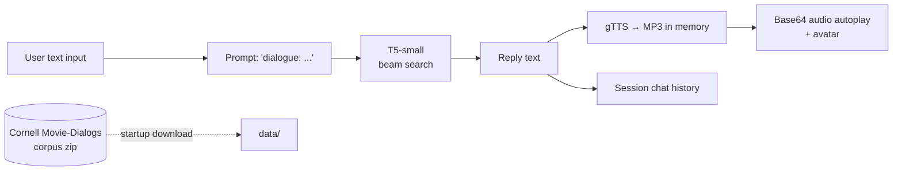

<div align="center">

# 🤖 Generative AI Voice Chatbot

**A Streamlit chat app that generates replies with Hugging Face T5-small and speaks them aloud with gTTS. Built around the Cornell Movie-Dialogs corpus.**


</div>

## Overview
Conversational interfaces are more engaging when they **talk back**. This project is a lightweight prototype of a voice-enabled chatbot: the user types a message, a transformer model generates a reply, and the reply is converted to speech and auto-played next to an avatar. The whole stack runs in a single Streamlit file, so it is easy to demo, deploy, or extend with a fine-tuned dialogue model.

## ✨ Features
- 💬 **Generative replies** from `t5-small` (Hugging Face Transformers) using beam search (5 beams, max 100 tokens)
- 🔊 **Text-to-speech**: each reply is synthesized with gTTS and auto-played in the browser
- 🧑 **Avatar UI** with a running chat history and a *Clear Conversation* button
- ⚡ **GPU-aware**: uses CUDA automatically when available
- 📦 **Corpus bootstrap**: downloads and extracts the Cornell Movie-Dialogs corpus at startup
- 🐳 **Dev Container / Codespaces**: launches `streamlit run app.py` on port 8501 automatically

> **Status:** the current build generates replies with the pretrained `t5-small` checkpoint. The Cornell corpus loaders (`data/`) are in place, and fine-tuning T5 on the extracted conversation pairs is the planned next step.

## 🔧 How It Works


## 🗂️ Dataset
**Cornell Movie-Dialogs Corpus** (Danescu-Niculescu-Mizil & Lee, 2011): ~220K conversational exchanges from 617 movie scripts. The archive is included at `data/cornell-movie-dialog-corpus.zip` (`movie_lines.txt`, `movie_conversations.txt`, metadata). Parsing helpers live in `data/movie_lines.txt` and `data/movie_converstations.txt`.

## 🧰 Tech Stack
Python · Streamlit · Hugging Face Transformers (T5) · PyTorch · gTTS · Requests · GitHub Codespaces Dev Container

## 📁 Repository Structure
```
generative-ai-chatbot/
├── app.py                          # Streamlit app: T5 generation + gTTS audio + avatar
├── requirements.txt
├── .devcontainer/devcontainer.json # Codespaces config (auto-runs Streamlit on :8501)
├── data/
│   ├── cornell-movie-dialog-corpus.zip
│   ├── movie_lines.txt             # parser snippet for movie lines
│   └── movie_converstations.txt    # parser snippet for conversations
└── images/
    ├── Man Avatar.png
    └── Man Avatar.webp
```

## ▶️ How to Run
```bash
git clone https://github.com/oxayavongsa/generative-ai-chatbot.git
cd generative-ai-chatbot
pip install streamlit transformers torch gTTS sentencepiece requests
streamlit run app.py
```
Then open `localhost:8501` in your browser. The first launch downloads the `t5-small` weights and the corpus, so allow a minute. gTTS needs internet access.

**Codespaces:** open the repo in a GitHub Codespace and the dev container installs dependencies and starts the app automatically.

---
<div align="center">
Built by <a href="https://github.com/oxayavongsa">Outhai (Thai) Xayavongsa</a> · <a href="https://oxayavongsa.github.io/ai-automation-portfolio/">Portfolio</a>
</div>
